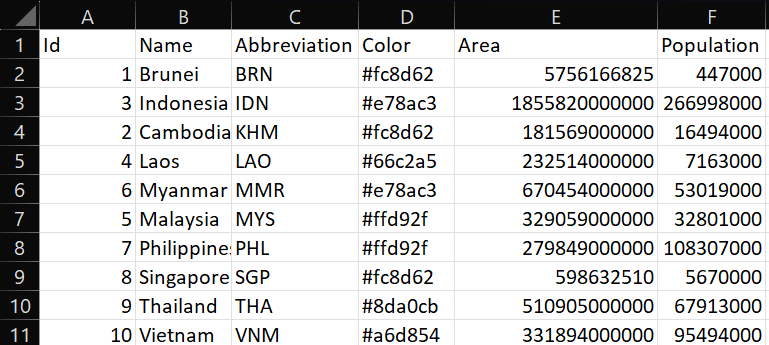

# Adding a Map

This guide will help you add a new map to the go-cart.io website. This guide assumes that you have already set up the website code for local testing and development by following the instructions here https://github.com/atima/cartogram-docker.

## Contents

- [Adding a Map](#adding-a-map)
  - [Contents](#contents)
  - [1. What You'll Need](#1-what-youll-need)
  - [2. Preparing Your Data](#2-preparing-your-data)
    - [2.1 Generating a GeoJSON file (`_processedmap.json`)](#21-generating-a-geojson-file-_processedmapjson)
    - [2.2 Generating csv file and edit the data:](#22-generating-csv-file-and-edit-the-data)
    - [(For a world map) Adding "extent":"world" and adjusting bbox values.](#for-a-world-map-adding-extentworld-and-adjusting-bbox-values)
  - [3. Initializing Your Map](#3-initializing-your-map)
  - [4. (Optional) Adding Colors and Labels Using SVG](#4-optional-adding-colors-and-labels-using-svg)
    - [Adding Colors](#adding-colors)
      - [Importing the ColorBrewer Color Palette Into Inkscape](#importing-the-colorbrewer-color-palette-into-inkscape)
      - [Coloring the Map Regions](#coloring-the-map-regions)
    - [Adding Labels](#adding-labels)
    - [Finishing Up](#finishing-up)
  - [5a. Saving Your Changes](#5a-saving-your-changes)

\* [Left/Right Map Display](#leftright-map-display)  \* [Exporting the cartogram animation to a gif](create_cart_animation_gif.md)

## 1. What You'll Need

To add a map, you will need the following files, information, and software:

- Conventional map geography, in .geojson format
- Map region names and abbreviations
- A dataset (e.g. population, GDP)
- (Optional) Inkscape, a free, open-source vector graphics editor for Windows, Mac, and Linux that can be downloaded at https://inkscape.org/.

## 2. Preparing Your Data

The first step in adding a map is to prepare your data.

### 2.1 Generating a GeoJSON file (`_processedmap.json`)

Select 1. or 2. to edit your map:

1. To use Mapshaper, follow the steps at https://github.com/bbkc22113/geojson-to-csv-cartogram-web. No need to follow step 3.
2. To use QGIS, follow the steps at [qgis_processing.md](qgis_processing.md). Then, follow steps 2.1 and 2.4 at https://github.com/bbkc22113/geojson-to-csv-cartogram-web to generate the necessary GeoJSON files (`_processedmap.json`) for your map.

Then, copy the GeoJSON (`_processedmap.json`) file for the conventional map into `cartogram-docker/cartogram-web/data`.

### 2.2 Generating csv file and edit the data:

Open `tools/geojson2csv.R` in RStudio. Adjust the following variables accourdingly.

    # Relative file path to input geojson file
    input <- "../data/asean_processedmap.json"

    # Relative file path and prefix to output files
    # e.g., the output 'asean2' will produce asean2.csv and asean2.geojson
    output <- "../data/asean2"

    # Region name property, e.g., NAME_1 if from GADM
    name_property <- "NAME_0"

    # Region abbreviation property, e.g., HASC_1 if from GADM
    abbr_property <- "GID_0"

Then, click on source. In the console, it should say "All done.".

Now, you should edit the CSV file. Insert the dataset with appropriate dataset name after the 'Color' column. The dataset name **must not** contain space or special characters. Note that data in the "Area" column should either come first or not at all. It is a special column that will be copied as-is and not processed by the cartogram generation algorithm.

You can input multiple datasets. You can also edit the data in 'Color' column. You can see examples of completed CSV files below:

**Important:** Before you finish, you should make sure that all of the region names are spelled correctly before you finish. If you notice that a region's name is misspelled, simply correct its spelling. Some region names may contain accent marks or other unicode characters. Please use only ASCII characters in your CSV file. Please note that after you initialize your map in the next step, you _cannot_ correct spelling errors. Please double check the spelling of all the map region names before moving on to the next step.

When you're finished creating your CSV file, you should save it in `cartogram-docker/cartogram-web/data`.

### (For a world map) Adding "extent":"world" and adjusting bbox values.

Open the geojson file generated from the R script in a text-editor.

Add in the `"extent":"world"` key-value pair after `"type": "FeatureCollection"`.
This will allow the cartogram executable to identify the GeoJSON as a world map.

Change the value for the `"bbox"` key to `[ -180, -90, 180, 90 ]` to accurately display the North and South Poles.

## 3. Initializing Your Map

From here on, you will be making use of the Add Map Wizard. Before you can use this wizard to initialize your new map, you must start the Docker containers for the go-cart.io website. To do this, run

    cd cartogram-docker/
    docker-compose up

Now you can run the Add Map Wizard. You will need to pick a name for your map to be used by the website code (this is different from the user-friendly name seen by website users). This name **must not** include spaces, hyphens, underscores, or any punctuation. Below are some example names for your reference:

    Map                     | Code Name
    United States           | usa
    Mainland China & Taiwan | china
    Germany                 | germany

This map name must be unique. The Add Map Wizard will let you know if your choice of code name has already been taken.

Once you have chosen a map name, you can open a new terminal window and run the Add Map Wizard.

    ./addmap.sh init your-map-name

The wizard will then ask you a series of questions about your map, and generate files needed to complete the map addition process. For instance, running

    ./addmap.sh init asean2

Should output something like this:

    Welcome to the Add Map Wizard!

    Enter a user friendly name for this map (asean2): Asean (5 years)

    Now I need to know where the .json and .csv files for this map are located. These files should be located in the CARTOGRAM_DATA_DIR directory. You should supply me with a path relative to CARTOGRAM_DATA_DIR.
    E.G: The .json file for this map is located at CARTOGRAM_DATA_DIR/map.json. Enter "map.json".

    Enter the location of the .json file for this map (asean2.geojson): asean2.geojson
    Enter the location of the .csv file for this map (asean2.csv): asean2.csv
    What are the regions of this map called (e.g. State, Province) (Region)? Country
    What is the name of datasets. Note that only letter with no space is allowed and it should match collumn name is .csv file. Use comma to separate each dataset (Area,Population)? 2017,2018,2019,2020,2021
    What is unit of each dataset, in order (sq. km,people)? people,people,people,people,people
    What is the labelling scheme (1):
    1. Auto labelling
    2. Manual labelling
    3. No label
    ? 3
    Writing static/cartdata/asean2/config.json...
    Writing static/cartdata/asean2/abbreviations.json...
    Writing static/cartdata/asean2/colors.json...
    Writing static/cartdata/asean2/template.csv...

    I will now generate the map and cartogram. This may take a moment.
    Generating 2017 map...
    Making request to AWS Lambda function at http://serverless:5050/cartogram.
    ...
    I will now finish up writing the map data files.

    Writing static/cartdata/asean2/2017.json...
    Generating 2018 map...
    Making request to AWS Lambda function at http://serverless:5050/cartogram.
    ...

    I will now finish up writing the map data files.

    Writing static/cartdata/asean2/2018.json...

    ...

    Generating map pack in static/cartdata/asean2/mappack.json...
    Updating /root/web/data/asean2.geojson...

    I will now modify handler.py to add your new map. Before I do this, I will back up the current version of handler.py to handler.py.bak.

    Backing up handler.py...

    All done!

## 4. (Optional) Adding Colors and Labels Using SVG

If you select 2 (Manual labelling) for the labelling scheme, the script will generate a SVG file in `cartogram-docker/cartogram-web/data`. You now have the option of adding colours and labels using a Python script & Inkscape.

1. Open the generated file (e.g., `asean2.svg`) in Inkscape to make any additional edits to the colours and labels as you see fit. If you need to add lines pointing labels to regions, please refer to [Adding Labels](#adding-labels). Once you have finished adding/editing all of your colours/labels, save your SVG file by going to File -> Save.

2. Replace the `.svg` in `cartogram-web/internal/data` with the edited file.

3. Continue with the second step of the Add Map Wizard under [Finishing Up](#finishing-up).

### Adding Colors

The go-cart.io website uses the same color scheme for all maps. The six colors you should use can be seen by going to the [color scheme page](http://colorbrewer2.org/#type=qualitative&scheme=Dark2&n=6) on ColorBrewer. To make the coloring process easier, you should download the ColorBrewer color palette file and import it into Inkscape (you only need to do this once).

#### Importing the ColorBrewer Color Palette Into Inkscape

First, download the color palette file at http://colorbrewer2.org/export/gpl/Dark2_6.gpl.

If you are using Linux, you should place the downloaded `Dark2_6.gpl` file into the folder `~/.config/inkscape/palettes`. Restart Inkscape.

If you are using Mac OS, you should navigate to the Applications folder. Find and right click on the Inkscape icon, and select 'Show Package Contents'. Navigate to 'Contents', 'Resources', and finally 'palettes'. You should copy the `Dark2_6.gpl` file into the 'palettes' folder. Restart Inkscape.

#### Coloring the Map Regions

Open `your-map.svg` in Inkscape. You should see a rendered version of your conventional map, with each region shaded with a light-gray.

First, ensure that the ColorBrewer color palette is selected. To do this, click the left-pointing arrow at the bottom right corner of the Inkscape window. Then, select the 'CB_qual_Dark2_6' palette.

The coloring process is straightforward. Left click on each region you want to color, and then left click on the color in the palette bar you want to apply to that region. Color the map as you wish while keeping in mind the following constraints:

- Neighboring regions **must not** have the same color.
- The distribution of colors throughout the map should be roughly equal. The default colors are not used to indicate data, but instead to allow users to clearly see the region boundaries.

**Important:** Some of your map regions may include many small polygons that are hard to spot in Inkscape. You don't have to color each one. The Add Map Wizard only requires that you color **one** polygon per map region (usually it is easiest if you color the largest one).

When you are done coloring each region, you should save your SVG file by going to `File -> Save`.

### Adding Labels

The go-cart.io website displays labels on the conventional map, which consist of text for region abbreviations, and lines. You can use Inkscape to add these labels. Open `your-map.svg` in Inkscape.

First, we'll add a text label. Click the text tool on the toolbar, left click on the map where you want to place the text label, and type the text you want to appear in the label.

After you've added the text label, go to `Text -> Convert to Text` in the menubar (if you don't do this, then the text label won't be detected by the Add Map Wizard). Then, adjust the font size to 14 so that the label text appears as it would on the website. The font size of the labels in Inkscape does not affect their appearance on the website, but setting it appropriately will make it easier for you to place them correctly. \* Note: Please use font size 12.5 for a world map.

Now, go to `Object -> Object Properties...`. Set the 'Label' field to `gocartlabel`, and click 'Set'. This will help the Add Map Wizard find your text labels in the SVG document.

If a region is too small to contain a text label, you can place the text label outside the map (but still within the bounding box), and include a line pointing from the label to the region. Click the line tool on the toolbar. Then, left click once on the image where you want the line to start. Left click again where you want the line to end, and right click to finish.

Again, go to `Object -> Object Properties...`. Set the 'Label' field to `gocartlabel`, and click 'Set'.

**Tip**: Once you have created one text label or line, you can create additional labels or lines much quicker. Simply select a finished text label or line, and press `CTRL-D` (or, right click on the text label or line and select 'Duplicate') to create a copy. You can then move around the duplicated label or line and edit its text or line path to create additional labels.

Once you have finished adding all of your labels, you should save your SVG file by going to `File -> Save`.

### Finishing Up

At this point, you're now ready to finish the map addition process. Open a Terminal window and navigate to the `cartogram-docker/` directory of the repository. Run the Add Map Wizard again:

    ./addmap.sh update your-map-name

## 5a. Saving Your Changes

Change directories to `cartogram-web/`. You should now commit your changes to a new Git branch, and push these changes to GitHub.

    git add internal/handler.py
    git add internal/static
    git add data/[map_name].geojson
    git commit -a -m "added map [New Map Name]"

Then, create a pull request on GitHub, and follow the instructions on [go-cart-io/carotgram-docker](https://github.com/go-cart-io/cartogram-docker)'s "Making changes to `cartogram-web`" section.

